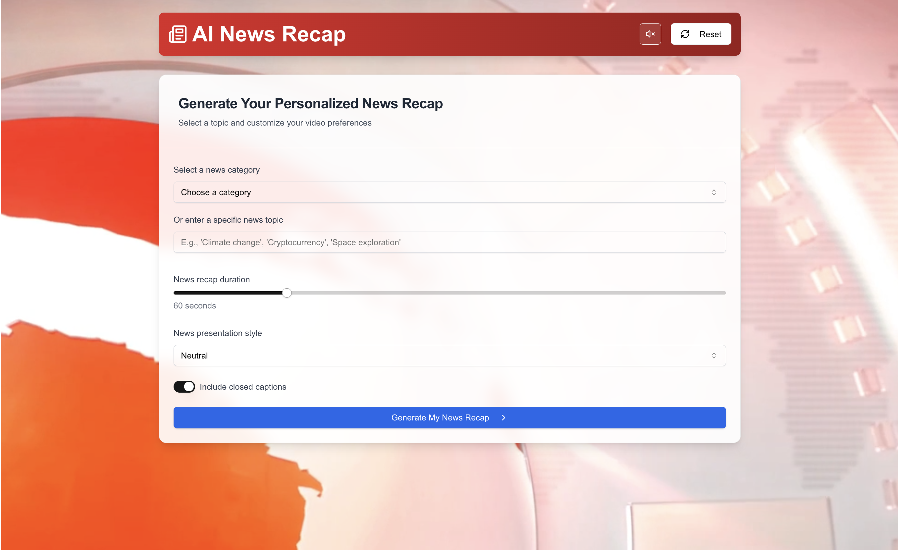
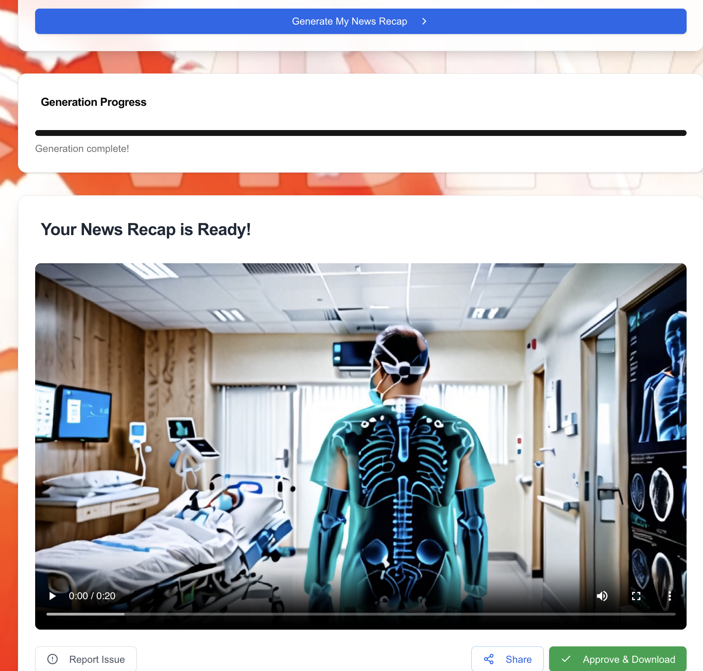
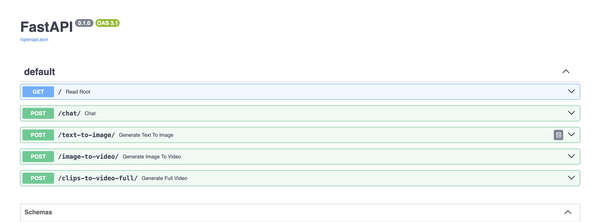

# News Recap Project





This project is a comprehensive news recap application that leverages the power of AI to generate engaging video summaries of the latest news. The frontend is built with Next.js, while the backend is powered by Python, utilizing the SwarmZero.ai and Livepeer.ai APIs.

## Table of Contents

- [Features](#features)
- [Architecture](#architecture)
- [Installation](#installation)
- [Usage](#usage)
- [Configuration](#configuration)
- [Project Structure](#project-structure)
- [Dependencies](#dependencies)
- [Contributing](#contributing)
- [Acknowledgements](#acknowledgements)

## Features

- AI-powered news topic gathering and summarization
- Automated video creation with text-to-image and image-to-video conversion
- Customizable video length and style
- Real-time video generation progress tracking

## Architecture

The application is structured into two main components:

1. **Frontend**: Built with Next.js, providing a user-friendly interface for selecting news topics and customizing video preferences.
2. **Backend**: Implemented in Python, utilizing SwarmZero.ai for agent-based video generation and Livepeer.ai for media processing.

## Installation

### Frontend

1. Clone the repository:

   ```bash
   git clone https://github.com/yourusername/news-recap-app.git
   cd news-recap-app
   ```

2. Install the dependencies:

   ```bash
   npm install
   ```

3. Run the development server:
   ```bash
   npm run dev
   ```

### Backend

1. Navigate to the `news_swarm` directory:

   ```bash
   cd news_swarm
   ```

2. Create a virtual environment using `venv`:

   ```bash
   python -m venv venv
   ```

3. Activate the virtual environment:

   - On Windows:

     ```bash
     .\venv\Scripts\activate
     ```

   - On macOS and Linux:
     ```bash
     source venv/bin/activate
     ```

4. Install the required Python packages:

   ```bash
   pip install -r requirements.txt
   ```

5. Set up environment variables:

   - Create a `.env` file in the `news_swarm` directory and add necessary API keys and credentials.

6. Set up YouTube API credentials if you also want upload to YouTube(not implemented here):

   - Place your `client_secret.json` file in the `news_swarm` directory.
   - Obtain your OAuth 2.0 API key from the [Google API Console](https://developers.google.com/identity/protocols/oauth2).

7. Start the backend server:
   ```bash
   uvicorn news_swarm.main:app --reload
   ```

## Usage

1. Start the backend server:

   ```bash
   uvicorn news_swarm.main:app --reload
   ```

   [http://localhost:8000/docs](http://localhost:8000/docs)` for the Swagger API documentation
   

2. Open the frontend in your browser at [http://localhost:3000](http://localhost:3000)`

3. Follow the prompts to select a news topic and customize your video preferences. The application will generate and display a video recap based on your input.

## Configuration

- The swarm behavior and agent settings can be configured in the `hive_config.toml` file located in the `news_swarm` directory.
- Adjust agent models, timeouts, and instructions as needed.

## Project Structure

- `src/`: Contains the Next.js frontend components and pages.
- `news_swarm/`: Contains the Python backend logic and agent definitions.
- `hive_config.toml`: Configuration file for the swarm and its agents.

## Dependencies

### Frontend

- Next.js
- React
- Tailwind CSS

### Backend

- FastAPI
- SwarmZero.ai
- Livepeer.ai
- MoviePy
- Google API Client

For a complete list of dependencies, refer to the `package.json` and `requirements.txt` files.

## Contributing

Contributions are welcome! Please feel free to submit a pull request or open an issue.

## Acknowledgements

- [Livepeer](https://livepeer.org) for providing AI image and video generation capabilities.
- [SwarmZero.ai](https://swarmzero.ai) for the swarm intelligence framework.
- [Encode.club](https://www.encode.club/) for organizing the AI Video Hackathon.
- [OpenAI](https://openai.com) for their AI models and tools.
- [Vercel](https://vercel.com) for their `v0` deployment platform.
